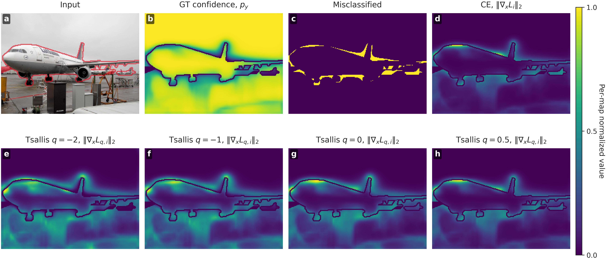

### TsallisPGD: Adaptive Gradient Weighting for Adversarial Attacks on Semantic Segmentation

**Alexander Matyasko, Xin Lou, Indriyati Atmosukarto, and Wei Zhang**
Singapore Institute of Technology
IJCNN 2026 (camera-ready)
Paper: [arXiv coming soon](https://arxiv.org/abs/TBD)

#### Abstract

Attacking semantic segmentation models is significantly harder than attacking image classification models because the attacker must change thousands of pixel predictions simultaneously. Standard pixel-wise cross-entropy (CE) is not well matched to this setting: it tends to overemphasize already-misclassified pixels, slowing optimization and overstating model robustness.

We introduce **TsallisPGD**, an adversarial attack based on the Tsallis cross-entropy, a generalization of CE parameterized by `q`. The objective adaptively reshapes the gradient landscape by controlling how gradient mass is distributed across pixels. By varying `q`, the attack can target pixels at different confidence levels.

We show that no single fixed `q` is universally optimal across datasets, model architectures, and perturbation budgets. Motivated by this, we use a dynamic linear `q` schedule that sweeps from `q = -2` to `q = 1` during optimization. Across Cityscapes, Pascal VOC, and ADE20K, TsallisPGD achieves the best average attack rank among CEPGD, SegPGD, CosPGD, JSPGD, and MaskedPGD in reducing pixel accuracy and mIoU on both standard and adversarially trained segmentation models.

---


### Evaluated Semantic Segmentation Models

This repository contains the evaluation harness used for the TsallisPGD paper. It covers standard MMSegmentation models, DDCAT robust models, and PIR-AT robust models. The PIR-AT checkpoints and evaluation conventions follow the public [Robust-Segmentation](https://github.com/nmndeep/Robust-Segmentation) repository.

| Model family                          | Dataset                | Training / source                                  | Config examples                                                   |
| ------------------------------------- | ---------------------- | -------------------------------------------------- | ----------------------------------------------------------------- |
| PSPNet / DeepLabV3+ / FCN / SegFormer | Cityscapes, Pascal VOC | Standard MMSegmentation checkpoints                | `configs/model/*cityscapes.yaml`, `configs/model/*voc2012.yaml`   |
| PSPNet ResNet-50                      | Cityscapes, Pascal VOC | DDCAT robust checkpoints                           | `pspnet_cityscapes_ddcat`, `pspnet_voc2012_ddcat`                 |
| UPerNet ConvNeXt-T/S CvSt             | Pascal VOC, ADE20K     | PIR-AT robust checkpoints from Robust-Segmentation | `convnext_t_cvst_robust_voc2012`, `convnext_t_cvst_robust_ade20k` |
| Segmenter ViT-S                       | ADE20K                 | PIR-AT robust checkpoint from Robust-Segmentation  | `segment_vit_s_robust_ade20k`                                     |

Note: checkpoint download locations are encoded in `scripts/download_models.sh`. Dataset locations and model checkpoint roots are configured through Hydra in `configs/paths/default.yaml`.

---

### TsallisPGD Attack

TsallisPGD replaces pixel-wise CE with Tsallis cross-entropy. In gradient space, each pixel is effectively weighted by `p_y ** (1 - q)`, where `p_y` is the predicted probability of the ground-truth class.

- `q = 1` recovers standard cross-entropy.
- `q < 1` emphasizes high-confidence, correctly classified pixels and down-weights pixels that are already broken.
- The main paper configuration uses a linear schedule from `q = -2` to `q = 1`.

The main attack config is:

```text
configs/attack/auto_multi_pgd_tsallis_ce_adaptive.yaml
```

It combines APGD step-size selection, a 300-iteration budget, one random start, the multi-epsilon trick, and the validation-selected adaptive Tsallis schedule.



**Figure:** Per-pixel input-gradient visualization for a semantic segmentation model under standard cross-entropy (CE) and Tsallis cross-entropy objectives. The top row shows the input image, the ground-truth class confidence map \(p_y\), a binary map of pixels already misclassified by the clean model, and the CE input-gradient norm \(\|\nabla_x L_i\|_2\). The bottom row shows Tsallis CE input-gradient norms \(\|\nabla_x L_{q,i}\|_2\) for \(q \in \{-2,-1,0,0.5\}\). Gradient maps are independently normalized per panel; therefore color indicates relative spatial importance within each loss, rather than absolute gradient magnitude across losses. As \(q\) decreases, Tsallis CE suppresses gradients on low-confidence or already-misclassified pixels and concentrates gradient mass around pixels where the model assigns higher probability to the ground-truth class.

#### Available attacks

| Attack                        | Hydra config                         |
| ----------------------------- | ------------------------------------ |
| CEPGD                         | `auto_multi_pgd_ce`                  |
| SegPGD                        | `auto_multi_pgd_ce_annealed`         |
| CosPGD                        | `auto_multi_pgd_ce_cossim`           |
| JSPGD                         | `auto_multi_pgd_js`                  |
| MaskedPGD                     | `auto_multi_pgd_masked_ce`           |
| TsallisPGD                    | `auto_multi_pgd_tsallis_ce_adaptive` |
| TsallisPGD fixed-`q` ablation | `auto_multi_pgd_tsallis_ce`          |

---

### Setup

The project is managed with [Pixi](https://pixi.sh). Install Pixi:

```bash
curl -fsSL https://pixi.sh/install.sh | bash
```

Then clone and bootstrap the repository:

```bash
git clone https://github.com/aam-at/tsallis_pgd.git
cd tsallis_pgd
pixi run setup
```

`pixi run setup` installs the Python environment, builds a CUDA-enabled `mmcv`, and downloads pretrained segmentation checkpoints.

Requirements:

- Linux x86-64
- NVIDIA GPU
- CUDA 13.0 toolchain, provisioned by Pixi
- Python 3.13, provisioned by Pixi

#### Data

Dataset downloads default to `$HOME/data`. Override with `DATA_ROOT` or pass an explicit root to the download script.

```bash
pixi run download-data-pascal-voc-aug
pixi run download-data-ade20k
pixi run download-data-cityscapes
```

Cityscapes download requires Cityscapes account credentials.

---

### Running TsallisPGD

The main entry point is the Hydra application `experiments/test.py`.

#### Pascal VOC, UPerNet ConvNeXt-T PIR-AT, `epsilon = 8/255`

```bash
pixi run python experiments/test.py \
  -cn test_voc2012 \
  model=convnext_t_cvst_robust_voc2012 \
  attack=auto_multi_pgd_tsallis_ce_adaptive \
  attack.base_epsilon=0.031372549 \
  attack.base_iterations=300 \
  task_name=tsallispgd_voc_demo
```

#### ADE20K, UPerNet ConvNeXt-T PIR-AT, `epsilon = 8/255`

```bash
pixi run python experiments/test.py \
  -cn test_ade20k \
  model=convnext_t_cvst_robust_ade20k \
  attack=auto_multi_pgd_tsallis_ce_adaptive \
  attack.base_epsilon=0.031372549 \
  attack.base_iterations=300 \
  task_name=tsallispgd_ade20k_demo
```

#### Cityscapes, PSPNet ResNet-50 DDCAT, `epsilon = 0.5/255`

```bash
pixi run python experiments/test.py \
  -cn test_cityscapes \
  model=pspnet_cityscapes_ddcat \
  attack=auto_multi_pgd_tsallis_ce_adaptive \
  attack.base_epsilon=0.001960784 \
  attack.base_iterations=300 \
  data.normalize=false \
  data.crop_size=449 \
  data.info.ignore_index=255 \
  task_name=tsallispgd_cityscapes_demo
```

Outputs are written under `runs/{task_name}/...`.

To override the adaptive schedule:

```bash
pixi run python experiments/test.py \
  attack=auto_multi_pgd_tsallis_ce_adaptive \
  loss.params.q_start=-3 \
  loss.params.q_end=0.5
```

For fixed-`q` ablations, use `attack=auto_multi_pgd_tsallis_ce` and set `loss.params.q`.

---

### Reproducing the Paper

Per-benchmark shell scripts wrap the sweeps over models, attacks, and perturbation budgets used in the paper:

```bash
cd experiments
./test_ddcat_cityscapes.sh
./test_pirat_voc2012.sh
./test_pirat_ade20k.sh
./test_mmseg_voc2012.sh
./test_mmseg_cityscapes.sh
```

Each script accepts the list of attacks to dispatch via its arguments. Shared command construction lives in `experiments/attack_utils.sh`. Result aggregation lives in `scripts/parse_attack_results.py`.

---

#### Citation

If you use this code or build on TsallisPGD, please cite:

```bibtex
@inproceedings{matyasko2026tsallispgd,
  title     = {{TsallisPGD}: Adaptive Gradient Weighting for Adversarial Attacks on Semantic Segmentation},
  author    = {Matyasko, Alexander and Lou, Xin and Atmosukarto, Indriyati and Zhang, Wei},
  booktitle = {International Joint Conference on Neural Networks (IJCNN)},
  year      = {2026}
}
```

##### Acknowledgements

This research is supported by the National Research Foundation, Singapore, under its AI Singapore Programme (AISG Award No: AISG4-GC-2023-006-1B); the Ministry of Education, Singapore, under its Academic Research Tier-1 Grant (Award No: 1091/R-MA124-R205-0002); and A\*STAR under its MTC Individual Research Grant (Award No: M23M6c0113) and MTC Programmatic Grant (Award No: M23L9b0052).

The evaluation harness builds on prior work in semantic segmentation robustness, including SegPGD, CosPGD, DDCAT, and the JSPGD/MaskedPGD/PIR-AT line of work. It also integrates pretrained checkpoints and conventions from [Robust-Segmentation](https://github.com/nmndeep/Robust-Segmentation), [MMSegmentation](https://github.com/open-mmlab/mmsegmentation), [Robust-Semantic-Segmentation](https://github.com/JIA-Lab-research/Robust-Semantic-Segmentation), and [Revisiting-AT](https://github.com/nmndeep/revisiting-at). We thank the authors for making their code and models available.
